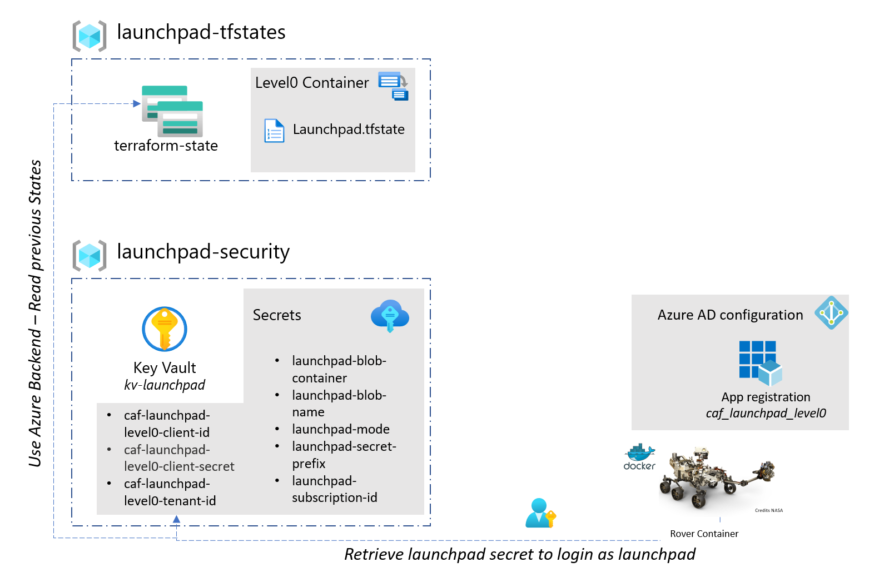

# Launchpad - scenario contoso / demo

The demo scenario is designed to demonstrate a basic functional foundations to store Terraform state on Azure storage and use it centrally.
The focus of this scenario is to be able to deploy a basic launchpad from a remote machine and use the portal to review the settings in a non-constrained environment.
For example in this scenario you can go to the Key Vaults and view the secrets from the portal, a feature that is disabled in the 300+ scenarios.
We recommend using the 100 scenario for demonstration purposes.

An estimated time of 5 minutes is required to deploy this scenario.

## Pre-requisites

This scenario require the following privileges:

| Component          | Privileges         |
|--------------------|--------------------|
| Active Directory   | None               |
| Azure subscription | Subscription owner |

## Deployment


### Pre-requisite

Elevate your credentials to the tenant root level to have enough privileges to create the management group hierarchy.

```bash

az rest --method post --url "/providers/Microsoft.Authorization/elevateAccess?api-version=2016-07-01"

```


```bash
rover login -t set_your_tenant_name.onmicrosoft.com

export ARM_USE_AZUREAD=true
caf_env="sandpit"

rover \
  -lz /tf/caf/landingzones/caf_launchpad \
  -var-folder /tf/caf/configuration/contoso/platform/demo/level0/launchpad \
  -tfstate caf_launchpad.tfstate \
  -log-severity ERROR \
  -launchpad \
  -env ${caf_env} \
  -level level0 \
  -a plan

rover \
  -lz /tf/caf/landingzones/caf_launchpad \
  -var-folder /tf/caf/configuration/contoso/platform/demo/level0/launchpad \
  -tfstate caf_launchpad.tfstate \
  -log-severity ERROR \
  -launchpad \
  -env ${caf_env} \
  -level level0 \
  -a destroy

```

## Architecture diagram


## Services deployed in this scenario

| Component             | Purpose                                                                                                                                                                                                                    |
|-----------------------|----------------------------------------------------------------------------------------------------------------------------------------------------------------------------------------------------------------------------|
| Resource group        | Multiple resource groups are created to isolate the services.                                                                                                                                                              |
| Storage account       | A storage account for remote tfstate management is provided for each level of the framework. Additional storage accounts are created for diagnostic logs.                                                                  |
| Key Vault             | The launchpad Key Vault hosts all secrets required by the rover to access the remote states, the Key Vault policies are created allowing the logged-in user to see secrets created and stored.                             |
| Virtual network       | To secure the communication between the services a dedicated virtual network is deployed with a gateway subnet, bastion service, jumpbox and azure devops release agents. Service endpoints is enabled but not configured. |
| Azure AD Applications | An Azure AD application is created. This account is mainly use to bootstrap the services during the initialization. It is also considered as a breakglass account for the launchpad landing zones                          |


# Next steps

When you have successfully deployed the launchpad you can  move to the next step.

 [Deploy the management services](../../level1/management/readme.md)
