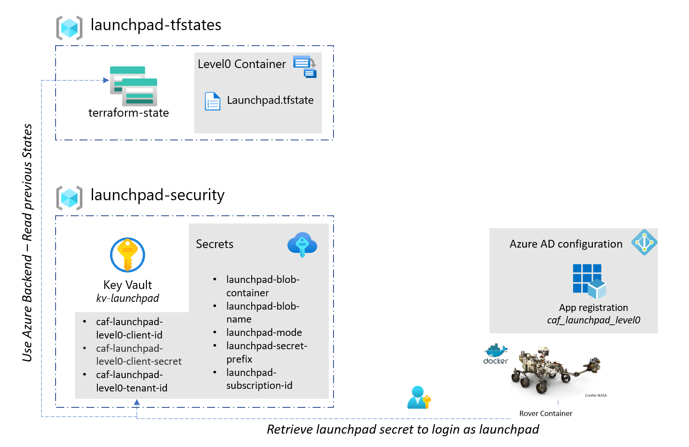

# Launchpad - scenario 100

The 100 scenario is designed to demonstrate a basic functional foundations to store Terraform state on Azure storage and use it centrally.
The focus of this scenario is to be able to deploy a basic launchpad from a remote machine and use the portal to review the settings in a non-constrained environment.
For example in this scenario you can go to the Key Vaults and view the secrets from the portal, a feature that is disabled in the 300+ scenarios.
We recommend using the 100 scenario for demonstration purposes.

An estimated time of 5 minutes is required to deploy this scenario.

## Pre-requisites

This scenario require the following privileges:

| Component          | Privileges         |
|--------------------|--------------------|
| Active Directory   | None               |
| Azure subscription | Subscription owner |

## Deployment

```bash
rover -lz /tf/caf/landingzones/caf_launchpad \
  -launchpad -var-folder \
  /tf/caf/landingzones/caf_launchpad/scenario/100 \
  -a apply

rover -lz /tf/caf/landingzones/caf_launchpad \
  -launchpad \
  -var-folder /tf/caf/landingzones/caf_launchpad/scenario/100 \
  -a destroy
```

## Architecture diagram


## Services deployed in this scenario

| Component             | Purpose                                                                                                                                                                                                                    |
|-----------------------|----------------------------------------------------------------------------------------------------------------------------------------------------------------------------------------------------------------------------|
| Resource group        | Multiple resource groups are created to isolate the services.                                                                                                                                                              |
| Storage account       | A storage account for remote tfstate management is provided for each level of the framework. Additional storage accounts are created for diagnostic logs.                                                                  |
| Key Vault             | The launchpad Key Vault hosts all secrets required by the rover to access the remote states, the Key Vault policies are created allowing the logged-in user to see secrets created and stored.                             |
| Virtual network       | To secure the communication between the services a dedicated virtual network is deployed with a gateway subnet, bastion service, jumpbox and azure devops release agents. Service endpoints is enabled but not configured. |
| Azure AD Applications | An Azure AD application is created. This account is mainly use to bootstrap the services during the initialization. It is also considered as a breakglass account for the launchpad landing zones                          |
