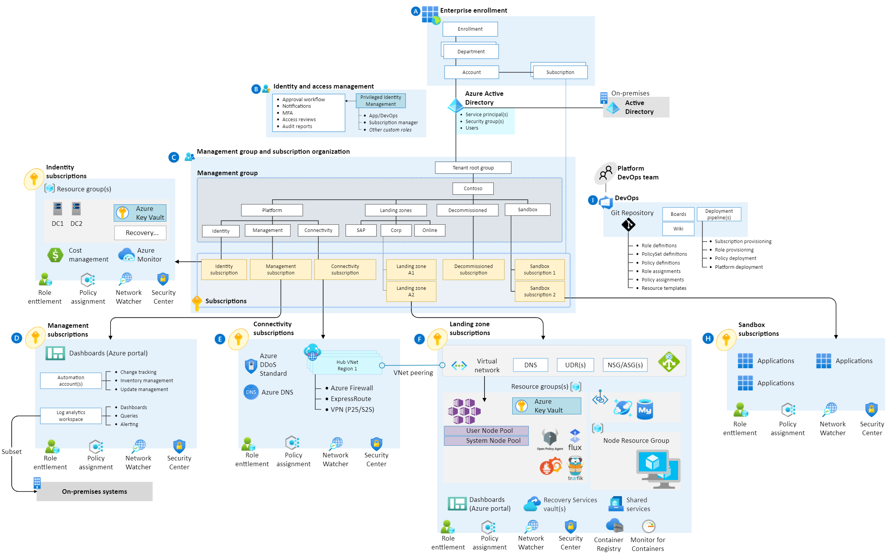

| Standalone                          | Landingzone                                                                                                                                                                                                                                                                                                                  |
|---------------------------------|----------------------------------------------------------------------------------------------------------------------------------------------------------------------------------------------------------------------------------------------------------------------------------------------------------------------------------|
| [](https://github.com/Azure/caf-terraform-landingzones-starter/actions/workflows/deploy-aks-online-standalone.yaml)|  [](https://github.com/Azure/caf-terraform-landingzones-starter/actions/workflows/deploy-aks-online-landingzone.yaml) |
[](https://dev.azure.com/hieunhu/caf-terraform-landingzones-starter/_build/latest?definitionId=52&branchName=starter) | [](https://dev.azure.com/hieunhu/caf-terraform-landingzones-starter/_build/latest?definitionId=54&branchName=starter) |

# Enterprise-Scale Construction Set for Azure Kubernetes Services using Terraform


Enterprise-scale is an architectural approach and a reference implementation that enables effective construction and operationalization of landing zones on Azure, at scale. This approach aligns with the Azure roadmap and the Cloud Adoption Framework for Azure.

The Azure Kubernetes Services Construction Set is an implementation of [AKS Secure Baseline Architecture](https://github.com/mspnp/aks-secure-baseline) for Enterprise-Scale Online Landing zone. An application deployed in a subscription for an online landing zone will be internet-facing, and does not require hybrid connectivity.

This implementation is based on [Cloud Adoption Framework Landing Zones for Terraform best practices](https://github.com/Azure/caf-terraform-landingzones).



## Applied Azure Policies for Online Landing zones

The list below details only notable Policies for this implementation, it is not exhaustive.
Please view Azure Policy portal or [List all assigned Azure Policies](#list-all-assigned-azure-policies) section to list out the details of assigned policies

| Policy                          | Config files                                                                                                                                                                                                                                                                                                                     |
|---------------------------------|----------------------------------------------------------------------------------------------------------------------------------------------------------------------------------------------------------------------------------------------------------------------------------------------------------------------------------|
| Deploy-AKS-Policy               | Deploy Azure Policy Add-on to Azure Kubernetes Service clusters                                                                                                                                                                                                                                                                  |
| Deny-Privileged-AKS             | Do not allow privileged containers in Kubernetes cluster. <br /> Excluded namespaces: kube-system; gatekeeper-system; azure-arc; **cluster-baseline-settings** <br /> <br />  **cluster-baseline-settings** namespace is dedicated to host Daemonsets components such as AKV Secret Store CSI driver, AAD Pod Identity, Kured... |
| Deny-Privileged-Escalations-AKS | Kubernetes clusters should not allow container privilege escalation <br /> Excluded namespaces: kube-system; gatekeeper-system; azure-arc; **cluster-baseline-settings**                                                                                                                                                         |
| Enforce-Https-Ingress-AKS       | Enforce HTTPS ingress in Kubernetes cluster                                                                                                                                                                                                                                                                                      |
| **Disable** Deny-Subnet-Without-Nsg            | This must be done for successful deployment of AKS Construction Set. <br /> Specifically, Azure SDK for Go and Terraform at the moment are not able to attach an NSG at Subnet creation time                                                                                                                                                                                                                                                                          |

<br />

### List all assigned Azure Policies

```Bash
# To view details of assigned Policies of the current Subscription
az policy assignment list --disable-scope-strict-match

# To view details of assigned Policies of the a resource
az policy assignment list --disable-scope-strict-match --scope {RESOURCEID}
```

# Next step

## Landing Zone

:arrow_forward: [Deploy infrastructures using CAF Terraform Landing zone](landingzone)

## Standalone

:arrow_forward: [Deploy infrastructures using Terraform CLI](standalone)