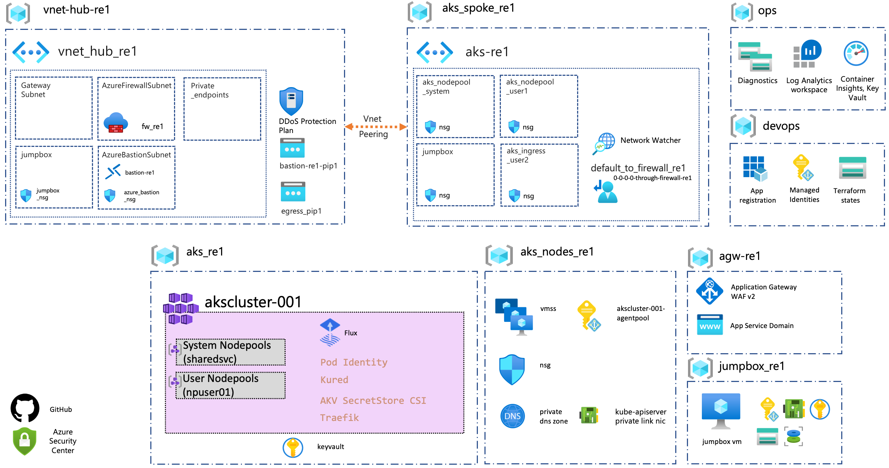

# Deployment of Enterprise-Scale AKS Construction Set

This reference implementation of AKS Secure Baseline Architecture within Enterprise Scale environment is built on CAF Terraform Landing zone framework composition.

The following components will be deployed by the Enterprise-Scale AKS Construction Set. You can review each component as described below:




| Components                                                                                              | Config files                                                 | Description|
|-----------------------------------------------------------|------------------------------------------------------------|------------------------------------------------------------|
| Global Settings |[global_settings.tfvars](configuration/global_settings.tfvars) | Primary Region setting. Changing this will redeploy the whole stack to another Region|
| Resource Groups | [resource_groups.tfvars](./configuration/resource_groups.tfvars)| Resource groups configs |
||<p align="center">**Azure Kubernetes Service**</p>||
| Azure Kubernetes Service | [aks.tfvars](./configuration/aks.tfvars) | AKS addons, version, nodepool configs |
| Identity & Access Management | [iam_aad.tfvars](./configuration/iam_aad.tfvars) <br /> [iam_managed_identities.tfvars](./configuration/iam_managed_identities.tfvars) <br /> [iam_role_mappings.tfvars](./configuration/iam_role_mappings.tfvars)| AAD admin group, User Managed Identities & Role Assignments |
||<p align="center">**Networking, Ingress, Egress**</p>||
| Virtual networks | [networking.tfvars](./configuration/networking.tfvars) <br /> [nsg.tfvars](./configuration/nsg.tfvars)| CIDRs, Subnets, NSGs configs |
| Application Gateway | [agw.tfvars](./configuration/agw.tfvars) <br /> [agw_application.tfvars](./configuration/agw_application.tfvars) <br />| Application Gateway WAF v2 Configs with aspnetapp workload settings |
| App Service Domains | [domain.tfvars](./configuration/domain.tfvars) | Public domain to be used in Application Gateway |
| Private DNS Zone | [private_dns.tfvars](./configuration/private_dns.tfvars) | Private DNS zone for AKS ingress; A record to Load Balancer IP |
| Azure Firewall  | [firewalls.tfvars](./configuration/firewalls.tfvars) <br /> [firewall_application_rule_collection_definition.tfvars](./configuration/firewall_application_rule_collection_definition.tfvars) <br /> [firewall_network_rule_collection_definition.tfvars](./configuration/firewall_network_rule_collection_definition.tfvars) <br /> [route_tables.tfvars](./configuration/route_tables.tfvars)  | Azure Firewall for restricting AKS egress traffic|
| Public IPs | [public_ips.tfvars](./configuration/public_ips.tfvars) | Public IPs for Application Gateway, Azure Firewall & Azure Bastion Host |
||<p align="center">**Security & Monitoring**</p>||
| Azure Key Vault| [keyvaults.tfvars](./configuration/keyvaults.tfvars) <br /> [certificate_requests.tfvars](./configuration/certificate_requests.tfvars) | Key Vault to store Self signed certificate for AKS ingress & Bastion SSH key |
| Azure Monitor | [diagnostics.tfvars](./configuration/diagnostics.tfvars) | Log Analytics Workspace for AKS logs & Prometheus metrics |
||<p align="center">**Bastion**</p>||
| Azure Bastion (OPTIONAL) | [bastion.tfvars](./configuration/bastion.tfvars) | Azure Bastion Host & Windows VM to view aspnetsample website internally. |

<br />

# Deployment

```bash
# Script to execute from bash shell

# Login to your Azure Subscription
az login

# Make sure you are using the right subscription
az account show -o table

# Go to the AKS construction set folder 
cd caf-terraform-landingzones-starter/enterprise_scale/construction_sets/aks

configuration_folder=online/aks_secure_baseline/configuration

# Define the configuration files to apply
parameter_files=("\
  -var-file=${configuration_folder}/global_settings.tfvars \
  -var-file=${configuration_folder}/resource_groups.tfvars \
  -var-file=${configuration_folder}/networking.tfvars \
  -var-file=${configuration_folder}/nsg.tfvars \
  -var-file=${configuration_folder}/firewalls.tfvars \
  -var-file=${configuration_folder}/firewall_application_rule_collection_definition.tfvars \
  -var-file=${configuration_folder}/firewall_network_rule_collection_definition.tfvars \
  -var-file=${configuration_folder}/public_ips.tfvars \
  -var-file=${configuration_folder}/keyvaults.tfvars \
  -var-file=${configuration_folder}/iam_aad.tfvars \
  -var-file=${configuration_folder}/iam_role_mappings.tfvars \
  -var-file=${configuration_folder}/aks.tfvars \
  -var-file=${configuration_folder}/route_tables.tfvars \
  -var-file=${configuration_folder}/diagnostics.tfvars \
  -var-file=${configuration_folder}/certificate_requests.tfvars \
  -var-file=${configuration_folder}/keyvaults.tfvars \
  -var-file=${configuration_folder}/iam_managed_identities.tfvars \
  -var-file=${configuration_folder}/private_dns.tfvars \
  -var-file=${configuration_folder}/domain.tfvars \
  -var-file=${configuration_folder}/agw.tfvars \
  -var-file=${configuration_folder}/agw_application.tfvars \
  ")

# OPTIONAL: -var-file=${configuration_folder}/bastion.tfvars \

export TF_VAR_logged_user_objectId=$(az ad signed-in-user show --query objectId -o tsv)

# Load the CAF module and related providers
terraform init -upgrade

# Create the plan
eval terraform plan -out="online-aks.tfplan" ${parameter_files}

# Trigger the deployment of the resources
terraform apply "online-aks.tfplan"

# (When needed) Destroy the resources
eval terraform destroy ${parameter_files}

# or if you are facing destroy issues
eval terraform destroy \
  ${parameter_files} \
  -refresh=false

```

# Next step

:arrow_forward: [Deploy sample workload into AKS](./02-aks.md)
