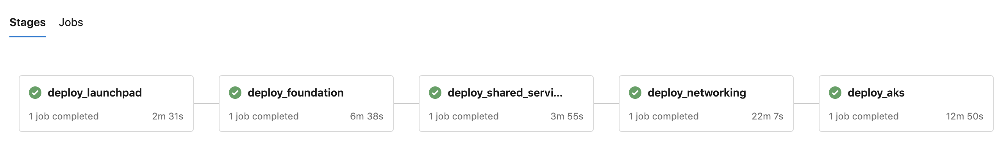

# Deployment of Enterprise-Scale AKS Construction Set by levels

## Deploying levels with IaC

An [IaC pipeline](../../../../../.github/workflows/deploy-secure-aks-baseline.yaml) deploys the AKS Construction Set in a multi-job fashion level by level.  


Every subsequent level is deployed on top of the deployment of the previous one. For example, level 3 "AKS cluster" can be deployed on the networking infrastructure deployed at the level 2 "Networking". The pipeline performs integration tests with Terratest after deployment of each level. So if, for example, tests fail after deployment of Networking then the pipeline will not proceed to the AKS deployment until the issue is resolved.    

The whole AKS Construction Set is decomposed by the IaC pipeline in the following levels:

| Level | Name | Content|
|-------|------|--------|
|    0  | Launchpad | The [launchpad infrastructure] with resource groups, storage accounts and KeyVaults to store the state of the deployment in the cloud
|    1  | Foundation | Resource groups, Managed Identities, KeyVaults|
|    2  | Shared Services | Log analytics and diagnostics|
|    2  | Networking | Networking infrastructure including Vnets, subnets, firewalls, Application Gateways, etc.
|    3  | AKS | Aks cluster | 
|    4  | Flux | Flux V2 with GitSource and Kustomization pointing to the [infrastructure configurations](./cluster-baseline-settings) | 


The pipeline requires the following secrets to be configured in the repository:
| Secret | Description |Sample|
|--------|-------------|------|
|ENVIRONMENT| Any name of your environment|sandpit|
|RESOURCE_PREFIX| Prefix for all names of the resources created by the pipeline|secureaks
|SERVICE_PRINCIPAL| Service Principal which will be used to provision resources||
|SERVICE_PRINCIPAL_PWD| Service Principal secret||
|SUBSCRIPTION_ID| Azure subscription id||
|TENANT| Azure tenant id||
|FLUX_TOKEN| GitHub Token for Flux V2|| 


To start the IaC pipeline execution, add to a PR or to an Issue on your repository "/deploy-all" comment. This comment will start deployment of all stages/levels in the pipeline from 0 (launchpad) to 4 (Flux). 
In order to deploy specific levels add one or a few of the following comments: "/deploy-launchpad", "/deploy-foundation", "/deploy-networking", "/deploy-shared-services", "/deploy-aks", "/deploy-flux".

In addition to the [GitHub Actions workflow](../../../../../.github/workflows/deploy-secure-aks-baseline.yaml), there is also an IaC [Azure Pipeline](../../../../../.pipelines/deploy-secure-aks-baseline.yaml) available to run on Azure DevOps orchestrator.



This pipeline can be started manually from Azure DevOps UI with specifying what stages/levels should be deployed. The pipeline expects the following environment variables to be configured in *iac-secure-caf* variable group:

| Variable | Description |Sample|
|--------|-------------|------|
|ENVIRONMENT| Any name of your environment|sandpit|
|PREFIX| Prefix for all names of the resources created by the pipeline|secureaks
|ARM_CLIENT_ID| Service Principal which will be used to provision resources||
|ARM_CLIENT_SECRET| Service Principal secret||
|ARM_SUBSCRIPTION_ID| Azure subscription id||
|ARM_TENANT_ID| Azure tenant id||
|AZURE_SERVICE_NAME| ARM Service connection name|iac-caf-connection|
|ROVER_IMAGE| Name and version of Rover Docker image|aztfmod/rover:0.14.8-2103.1601|
|TF_VAR_github_owner| Owner of GitHub repo with cluster configurations |Azure|
|TF_VAR_github_token| PAT with write access to the repo with cluster configurations  ||  

## Deploying levels manually
Alternatively you can deploy the construction set level by level manually with *rover*.

```bash
# Go to the AKS construction set folder 
cd caf-terraform-landingzones-starter

# Start Rover container
docker run -it --rm -v $(pwd):/tf/caf --user 0  aztfmod/rover:0.14.8-2103.1601 bash

# Login to your Azure Active Directory tenant
az login -t {TENANTNID}

# Make sure you are using the right subscription
az account show -o table

# If you are not in the correct subscription, change it substituting SUBSCRIPTIONID with the proper subscription  id
az account set --subscription {SUBSCRIPTIONID}

# Provide Azure credentials 
export ARM_CLIENT_ID=<ARM_CLIENT_ID>
export ARM_CLIENT_SECRET=<ARM_CLIENT_SECRET>
export ARM_SUBSCRIPTION_ID=<ARM_SUBSCRIPTION_ID>
export ARM_TENANT_ID=<ARM_TENANT_ID>

# CD to the construction set folder
cd /tf/caf/enterprise_scale/construction_sets/aks

# Provision a launchpad
. scripts/launchpad.sh

# Export prefix for the resources 
export PREFIX=<MY_UNIQUE_PREFIX>

# Deploy level 1. Foundation 
./scripts/deploy_level_with_rover.sh 1_foundation

# Deploy level 2. Shared Services 
./scripts/deploy_level_with_rover.sh 2_shared_services

# Deploy level 2. Networking
./scripts/deploy_level_with_rover.sh 2_networking

# Deploy level 3. AKS
./scripts/deploy_level_with_rover.sh 3_aks

# Deploy level 4. Flux
./scripts/deploy_level_with_rover.sh 4_flux

# Get access to the K8s cluster
echo $(terraform output -json | jq -r .aks_clusters_kubeconfig.value.cluster_re1.aks_kubeconfig_admin_cmd) | bash

# Check connection
kubectl get ns

```