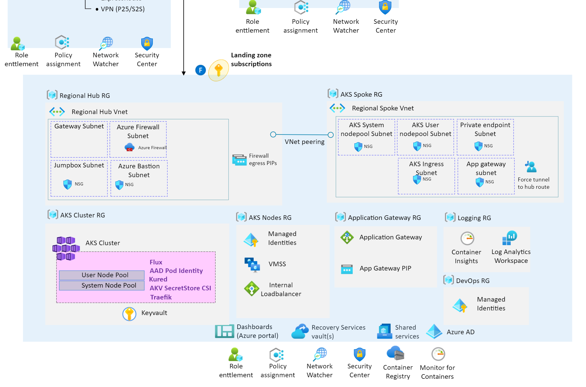

# Deployment of Enterprise-Scale AKS Construction Set

This reference implementation of AKS Secure Baseline Architecture within Enterprise Scale environment is built on CAF Terraform Landing zone framework composition.

The following components will be deployed by the Enterprise-Scale AKS Construction Set. You can review each component as described below:



| Components                                                                                              | Config files                                                 | Description|
|-----------------------------------------------------------|------------------------------------------------------------|------------------------------------------------------------|
| Global Settings |[global_settings.tfvars](../configuration/global_settings.tfvars) | Primary Region setting. Changing this will redeploy the whole stack to another Region|
| Resource Groups | [resource_groups.tfvars](../configuration/resource_groups.tfvars)| Resource groups configs |
| Azure Kubernetes Service | [aks.tfvars](../configuration/aks.tfvars) | AKS addons, version, nodepool configs |
||<p align="center">**Identity & Access Management**</p>||
| Identity & Access Management | [iam_aad.tfvars](../configuration/iam/iam_aad.tfvars) <br /> [iam_managed_identities.tfvars](../configuration/iam/iam_managed_identities.tfvars) <br /> [iam_role_mappings.tfvars](../configuration/iam/iam_role_mappings.tfvars)| AAD admin group, User Managed Identities & Role Assignments |
||<p align="center">**Gateway**</p>||
| Application Gateway | [agw.tfvars](../configuration/agw/agw.tfvars) <br /> [agw_application.tfvars](../configuration/agw/agw_application.tfvars) <br />| Application Gateway WAF v2 Configs with aspnetapp workload settings |
| App Service Domains | [domain.tfvars](../configuration/agw/domain.tfvars) | Public domain to be used in Application Gateway |
||<p align="center">**Networking**</p>||
| Virtual networks | [networking.tfvars](../configuration/networking/networking.tfvars) <br /> [peerings.tfvars](../configuration/networking/peerings.tfvars) <br /> [nsg.tfvars](../configuration/networking/nsg.tfvars) <br /> [ip_groups.tfvars](../configuration/networking/ip_groups.tfvars)| CIDRs, Subnets, NSGs & peerings config for Azure Firewall Hub & AKS Spoke |
| Private DNS Zone | [private_dns.tfvars](../configuration/networking/private_dns.tfvars) | Private DNS zone for AKS ingress; A record to Load Balancer IP |
| Azure Firewall  | [firewalls.tfvars](../configuration/networking/firewalls.tfvars) <br /> [firewall_application_rule_collection_definition.tfvars](../configuration/networking/firewall_application_rule_collection_definition.tfvars) <br /> [firewall_network_rule_collection_definition.tfvars](../configuration/networking/firewall_network_rule_collection_definition.tfvars) <br /> [route_tables.tfvars](../configuration/networking/route_tables.tfvars)  | Azure Firewall for restricting AKS egress traffic|
| Public IPs | [public_ips.tfvars](../configuration/networking/public_ips.tfvars) | Public IPs for Application Gateway, Azure Firewall & Azure Bastion Host |
||<p align="center">**Security & Monitoring**</p>||
| Azure Key Vault| [keyvaults.tfvars](../configuration/keyvault/keyvaults.tfvars) <br /> [certificate_requests.tfvars](../configuration/keyvault/certificate_requests.tfvars) | Key Vault to store Self signed certificate for AKS ingress & Bastion SSH key |
| Azure Monitor | [diagnostics.tfvars](../configuration/monitor/diagnostics.tfvars)  <br /> [log_analytics.tfvars](../configuration/monitor/log_analytics.tfvars) | Diagnostics settings, Log Analytics Workspace for AKS logs & Prometheus metrics |
||<p align="center">**Bastion**</p>||
| Azure Bastion (OPTIONAL) | [bastion.tfvars](../configuration/bastion/bastion.ignore) | Azure Bastion Host & Windows VM to view aspnetsample website internally. |

<br />

## Deployment

```bash
# Script to execute from bash shell

# Login to your Azure Active Directory tenant
az login -t {TENANTNID}

# Make sure you are using the right subscription
az account show -o table

# If you are not in the correct subscription, change it substituting SUBSCRIPTIONID with the proper subscription  id
az account set --subscription {SUBSCRIPTIONID}

# If you are running in Azure Cloud Shell, you need to run the following additional command:
# export TF_VAR_logged_user_objectId=$(az ad signed-in-user show --query objectId -o tsv)
```
Set the folder to Standalone
```bash
# Go to the AKS construction set standalone folder
cd caf-terraform-landingzones-starter/enterprise_scale/construction_sets/aks/online/aks_secure_baseline/standalone/
# If opened in containter in VSCode
cd /tf/caf/enterprise_scale/construction_sets/aks/online/aks_secure_baseline/standalone/
```
Deploy with Terraform
```bash

# Define the configuration files to apply, all tfvars files within the above folder recursively except for launchpad subfolder which is not relevant for this standalone guide
parameter_files=$(find configuration -not -path "*launchpad*" | grep .tfvars | sed 's/.*/-var-file &/' | xargs)

# Load the CAF module and related providers
terraform init -upgrade

# Trigger the deployment of the resources
eval terraform apply ${parameter_files}
```
## Next step

:arrow_forward: [Deploy sample workload into AKS](./aks.md)
