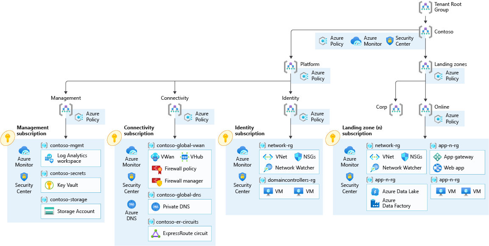

# Cloud Adoption Framework landing zones for Terraform - Enterprise Scale Integration Scenario

## CONTOSO REFERENCE ARCHITECTURE

https://github.com/Azure/Enterprise-Scale/blob/main/docs/reference/contoso/Readme.md



Assumptions:

- Sandpit environment is meant to be run locally and could optionally be run within Azure DevOps pipelines.
- Sandpit environment implements diagnostics and logs for every solution deployed.
- Sandpit environment implements rudimentary RBAC model.
- All resources are provisioned in the same subscription, optionally can be spread across subscriptions.

## Deploying with local experience

After completing the steps from the general [configuration readme](../README.md), you can start using the sandpit deployment:

You can then specify the environment you are running:

```bash
export environment=sandpit
```

### 1. Launchpad-level0 landing zones

#### Deploy the launchpad

```bash
rover -lz /tf/caf/public/landingzones/caf_launchpad \
  -var-folder /tf/caf/enterprise_scale/contoso/level0/launchpad \
  -parallelism 30 \
  -level level0 \
  -env ${environment} \
  -launchpad \
  -a [plan|apply|destroy]
```

### 2. Level 1 landing zones

#### Deploy foundations, management subscription

This layers deploys the CAF foundations

```bash
rover -lz /tf/caf/public/landingzones/caf_foundations/ \
  -var-folder /tf/caf/enterprise_scale/contoso/level1/management \
  -tfstate caf_foundations.tfstate \
  -parallelism 30 \
  -level level1 \
  -env ${environment} \
  -a [plan|apply|destroy]
```

#### Deploy Enterprise Scale components

This layers deploys the ES components (Management groups, policies):

```bash
rover -lz /tf/caf/public/landingzones/caf_eslz/ \
  -var-folder /tf/caf/enterprise_scale/contoso/level1/eslz \
  -tfstate caf_eslz.tfstate \
  -parallelism 30 \
  -level level1 \
  -env ${environment} \
  -a [plan|apply|destroy]
```

### 3. Level 2 landing zones

#### Deploy the connectivity subscription

```bash
rover -lz /tf/caf/public/landingzones/caf_networking/ \
  -tfstate contoso_connectivity.tfstate \
  -var-folder /tf/caf/enterprise_scale/contoso/level2/connectivity \
  -parallelism 30 \
  -level level2 \
  -env ${environment} \
  -a [plan|apply|destroy]
```

#### Deploy the identity subscription

```bash
rover -lz /tf/caf/public/landingzones/caf_solutions/ \
  -tfstate contoso_identity.tfstate \
  -var-folder /tf/caf/enterprise_scale/contoso/level2/identity \
  -parallelism 30 \
  -level level2 \
  -env ${environment} \
  -a [plan|apply|destroy]
```

#### Deploy the shared services

```bash
rover -lz /tf/caf/public/landingzones/caf_shared_services/ \
  -tfstate contoso_shared_services.tfstate \
  -var-folder /tf/caf/enterprise_scale/contoso/level2/shared_services \
  -parallelism 30 \
  -level level2 \
  -env ${environment} \
  -a [plan|apply|destroy]
```
