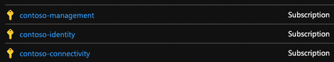

To deploy the Platform Landingzones in existing Azure subscriptions, you need the following pre-requisites

## pre-requisites

- Tenant root admin role
- Owner on the Azure subscriptions

### List of existing subscriptions

