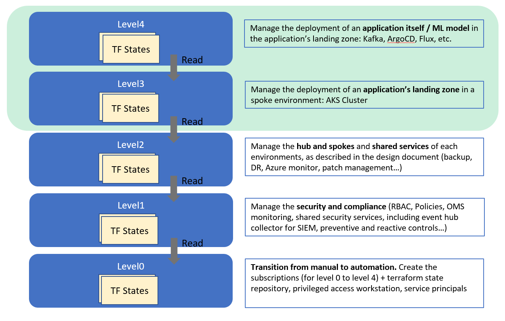

# CAF landing zones for Terraform - AKS landing zone examples

AKS landing zones are designed to fit into an enterprise-scale environment, in this guide, you will find the steps to bootstrap an environment to deploy the AKS landing zones.

## AKS landing zones examples

The CAF landing zone for AKS provides you with the following examples:

## Cloud Adoption Framework layered approach

AKS landing zone operates at **level 3** (light green area), so before you are able to deploy them you will need to deploy the prerequisites enterprise landing zones.

For a review of the hierarchy approach of Cloud Adoption Framework for Azure landing zones on Terraform, you can refer to [the following documentation](https://github.com/Azure/caf-terraform-landingzones/blob/master/documentation/code_architecture/hierarchy.md).

### Core AKS landing zone (level 3)

| AKS landing zone example                                                                                              | Description                                                |
|---------------------------------------------------------------------------------------------------|------------------------------------------------------------|
| [101-single-cluster](./aks/101-single-cluster)| Provision single AKS cluster within open virtual network |
| [102-multi-nodepools](./aks/102-multi-nodepools)| Provision single AKS cluster with multiple node pool within separate subnet (1 open virtual network). |
| [103-multi-clusters](./aks/103-multi-clusters)| Provision multiple AKS clusters in separate regions, using availability zones.                     |
| [104-private-cluster](./aks/104-private-cluster)| Provision private AKS clusters within private virtual network with Hub & Spoke UDR to Azure Firewall |
| [401-blue-green-nodepool](./aks/401-blue-green-nodepool)| Provision single AKS cluster and perform blue green nodepool upgrade with zero downtime |

### AKS Application landing zone  (level 4)

Deploys Applications Landing zone on top of an AKS Landing zone
| Application Landing Zone Example                                                                                              | Description                                                |
|---------------------------------------------------------------------------------------------------|------------------------------------------------------------|
| [Flux](./examples/applications/flux)| Provision Flux helm charts on AKS LZ |
| [ArgoCD](./examples/applications/argocd)| Provision ArgoCD helm charts on AKS LZ |

## Setting up your test environment

In order to deploy the AKS landing zones, you must beforehand deploy either a demo or sandpit environment  up to level 2.

This can be achieved following the steps there [configuration](../../configuration)