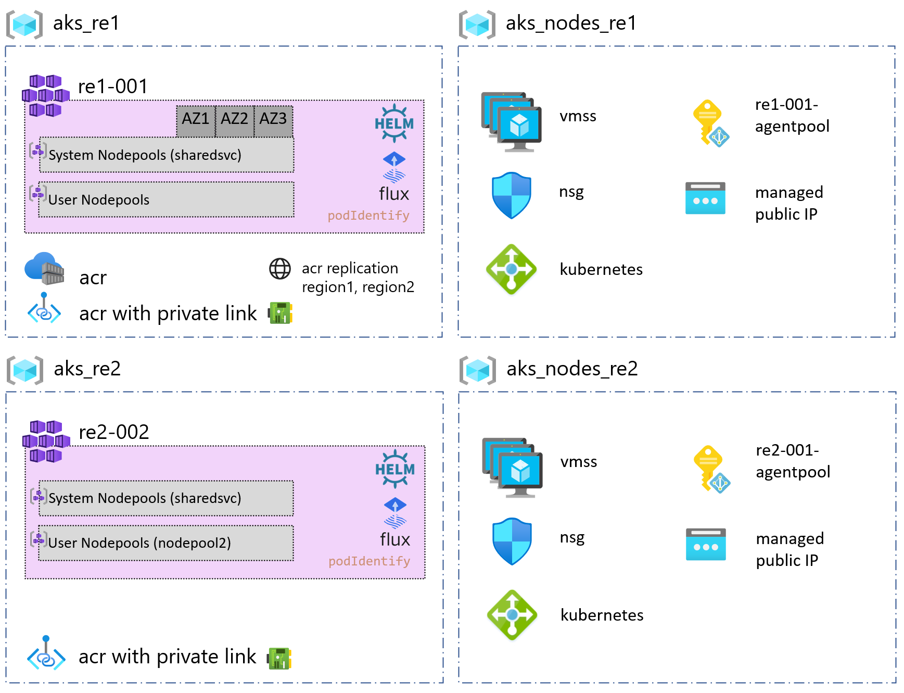

# CAF landing zones for Terraform - AKS Multi Clusters example

Deploys two AKS cluster in two regions, with two virtual networks:
- 1 in region1 - Availability zones (1,2,3) enabled for Default System Pool
- 1 in region2 - no Availability Zone

AKS landing zone operates at **level 3**.

For a review of the hierarchy approach of Cloud Adoption Framework for Azure landing zones on Terraform, you can refer to [the following documentation](../../../../documentation/code_architecture/hierarchy.md).

## Prerequisites

Before running this example, please make sure you have setup your environment as described in the [following guide](../../readme.md)

## Architecture diagram

This example will sit on the [prerequisites environment](../../readme.md) and will allow you to deploy the following additional topology:



## Components deployed by this example

| Component                                | Type of resource                 | Purpose                                                        |
|------------------------------------------|----------------------------------|----------------------------------------------------------------|
| aks_re1, aks_nodes_re1                   | Resource group                   | resource group to host the cluster and the node pool resources |
| re1-001, re2-001                         | AKS Cluster                      | AKS Cluster                                                    |
| acr, acr replicas in region1 and region2 | Azure Container Registry         | Azure Container Registry with replication                      |
| sharedsvc on re1-001, re2-001            | AKS node pool                    | re1-001 node pool available within 3 availability zones.       |
| managed public IP                        | Public IP                        | Public IP address for the node pools.                          |
| managed VMSS                             | Virtual Machines Scale Sets      | Scale sets for the node pools.                                 |
| managed load balancer                    | Load balancer                    | Load balancer for the node pools.                              |
| re1-001 and re2-001 agentpool            | System Assigned Managed Identity | Managed identity for the node pools.                           |
| private link            | Private link for ACR | Private link for AKS cluster to access ACR                           |
| network interface cards         | network interface cards | NIC for private link for AKS cluster to access ACR                           |

## Deploying this example

Ensure the below is set prior to apply or destroy.

```bash
# Login the Azure subscription
rover login -t [TENANT_ID/TENANT_NAME] -s [SUBSCRIPTION_GUID]
# Environment is needed to be defined, otherwise the below LZs will land into sandpit which someone else is working on
environment=[YOUR_ENVIRONMENT]
example=103-multi-clusters
```

### Run AKS landing zone deployment

```bash
rover -lz /tf/caf/landingzones/caf_solution/ \
  -tfstate landingzone_aks.tfstate \
  -var-folder /tf/caf/reference_implementations/azure_kubernetes_services/aks/${example} \
  -var tags={example=\"${example}\"} \
  -env ${environment} \
  -level level3 \
  -a [plan|apply|destroy]
```
