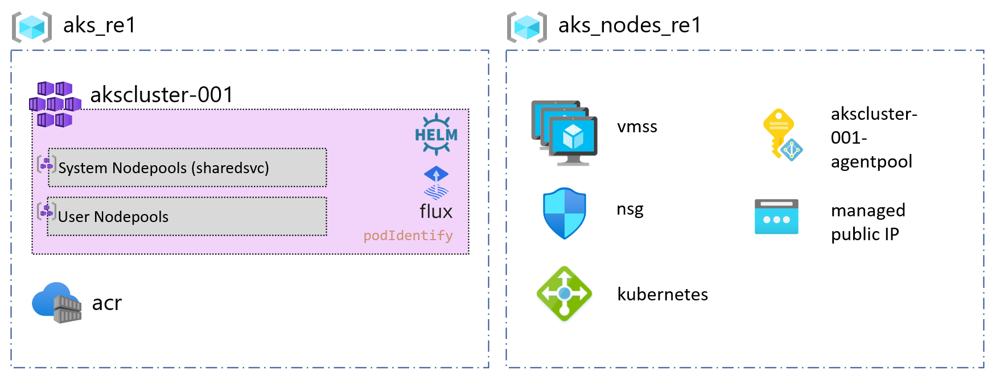

# CAF landing zones for Terraform - AKS Single Cluster example

Deploys a Single AKS cluster in a virtual network, with one node pool.

AKS landing zone operates at **level 3**.

For a review of the hierarchy approach of Cloud Adoption Framework for Azure landing zones on Terraform, you can refer to [the following documentation](../../../../documentation/code_architecture/hierarchy.md).

## Prerequisites

Before running this example, please make sure you have setup your environment as described in the [following guide](../../readme.md)

## Architecture diagram

This example will sit on the [prerequisites environment](../../readme.md) and will allow you to deploy the following additional topology:



## Components deployed by this example

| Component                | Type of resource                 | Purpose                                                        |
|--------------------------|----------------------------------|----------------------------------------------------------------|
| aks_re1, aks_nodes_re1   | Resource group                   | resource group to host the cluster and the node pool resources |
| akscluster-001           | AKS Cluster                      | AKS Cluster                                                    |
| acr                      | Azure Container Registry         | Azure Container Registry to store containers                   |
| sharedsvc                | AKS node pool                    | Default node pool for AKS cluster                              |
| managed public IP        | Public IP                        | Public IP address for the node pool.                           |
| managed VMSS             | Virtual Machines Scale Set       | Scale set for the node pool.                                   |
| managed load balancer    | Load balancer                    | Load balancer for the node pool.                               |
| akscluster-001-agentpool | System Assigned Managed Identity | Managed identity for the node pool.                            |

## Deploying this example

Ensure the below is set prior to apply or destroy.

```bash
# Login the Azure subscription
rover login -t [TENANT_ID/TENANT_NAME] -s [SUBSCRIPTION_GUID]
# Environment is needed to be defined, otherwise the below LZs will land into sandpit which someone else is working on
export environment=[YOUR_ENVIRONMENT]
# Set the folder name of this example
example=401-blue-green-nodepool

```

## Run AKS landing zone deployment

### Step 0: Deploy Blue Nodepool

```bash
rover -lz /tf/caf/landingzones/caf_solution/ \
  -tfstate landingzone_aks.tfstate \
  -var-file /tf/caf/reference_implementations/azure_kubernetes_services/aks/${example}/configuration.tfvars \
  -var-file /tf/caf/reference_implementations/azure_kubernetes_services/aks/${example}/aks_step0.tfvars \
  -var tags={example=\"${example}\"} \
  -env ${environment} \
  -level level3 \
  -a [plan|apply|destroy]
```

### Step 1: Upgrade Control Plane, system Nodepool and adding Green Nodepool
```bash
rover -lz /tf/caf/landingzones/caf_solution/ \
  -tfstate landingzone_aks.tfstate \
  -var-file /tf/caf/reference_implementations/azure_kubernetes_services/aks/${example}/configuration.tfvars \
  -var-file /tf/caf/reference_implementations/azure_kubernetes_services/aks/${example}/aks_step1.tfvars \
  -var tags={example=\"${example}\"} \
  -env ${environment} \
  -level level3 \
  -a [plan|apply|destroy]

```

### Step 2: Cordon, Drain & Delete Blue Nodepool
Login to the cluster using *aks_kubeconfig_admin_cmd* or *aks_kubeconfig_cmd* output: *"az aks get-credentials..."*

```bash
rover -lz /tf/caf/landingzones/caf_solution/ \
  -tfstate landingzone_aks.tfstate \
  -level level3 \
  -a output \
  -json \
  -o output.json

cat output.json | jq -r .aks_clusters.value.cluster_aks.cluster_re1.aks_kubeconfig_admin_cmd | bash
```

Cordon Blue NodePool

```bash
kubectl cordon -l agentpool=nodepool1
```

Drain Blue NodePool
```bash
kubectl drain -l agentpool=nodepool1 --ignore-daemonsets --delete-local-data
```

Delete Blue NodePool
```bash
rover -lz /tf/caf/public/landingzones/caf_solution/ \
  -tfstate ${example}_landingzone_aks.tfstate \
  -var-file /tf/caf/reference_implementations/azure_kubernetes_services/aks/${example}/configuration.tfvars \
  -var-file /tf/caf/reference_implementations/azure_kubernetes_services/aks/${example}/aks_step2.tfvars \
  -var tags={example=\"${example}\"} \
  -env ${environment} \
  -level level3 \
  -a [plan|apply|destroy]
```
