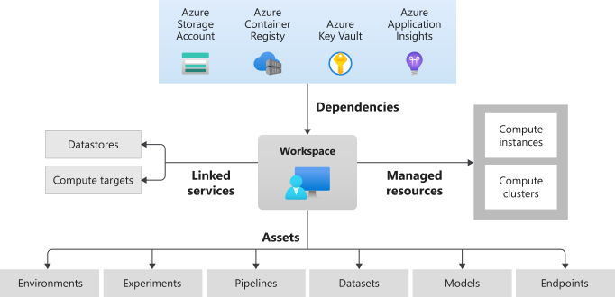

# CAF landing zones for Terraform - Azure Machine Learning (AML) example

Deploys a AML Workspace.

DAP landing zone operates at **level 3**.

For a review of the hierarchy approach of Cloud Adoption Framework for Azure landing zones on Terraform, you can refer to [the following documentation](https://github.com/Azure/caf-terraform-landingzones/blob/master/documentation/code_architecture/hierarchy.md).

## Prerequisites

Before running this example, please make sure you have setup your environment as described in the [following guide](../../readme.md)

## Architecture diagram

This example will sit on the [prerequisites environment](../../readme.md) and will allow you to deploy the following additional topology:

