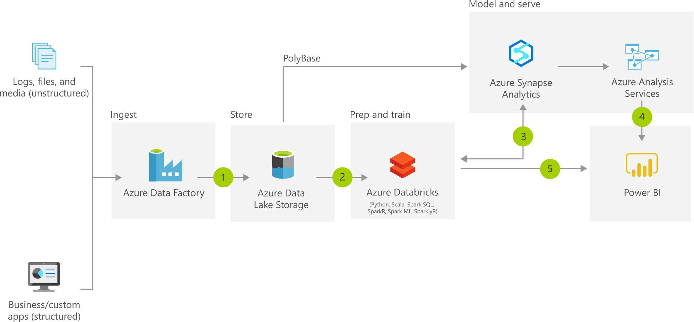

# CAF landing zones for Terraform - Synaspe Analytics example

Deploys a Synapse workspace, with sparkp  pool and SQL pool in virtual network.

DAP landing zone operates at **level 3**.

For a review of the hierarchy approach of Cloud Adoption Framework for Azure landing zones on Terraform, you can refer to [the following documentation](https://github.com/Azure/caf-terraform-landingzones/blob/master/documentation/code_architecture/hierarchy.md).

## Prerequisites

Before running this example, please make sure you have setup your environment as described in the [following guide](../../README.md)

## Architecture diagram

This example will sit on the [prerequisites environment](../../README.md) and will allow you to deploy the following additional topology:

## Examples

| Scenario                    | Description                                                               |
|-------------------          |---------------------------------------------------------------------------|
| 101-synapse-workspace       | Set up Simple Synaspe workspace with serverless SQL pool                  |
| 102-synapse-workspace-pool  | Set up workspace with SQL pool / Spark pool dedicated capacity            |
